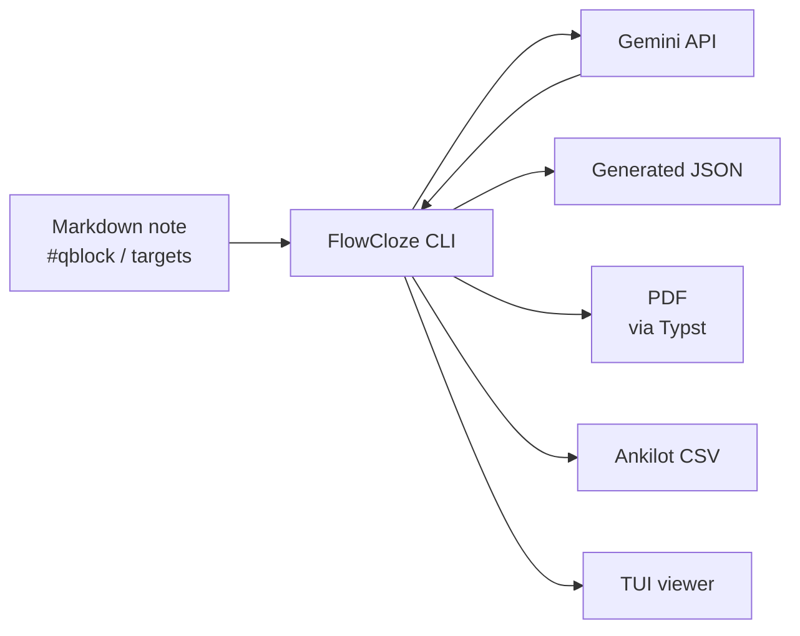

# FlowCloze

[日本語](README.md) | English

FlowCloze is a CLI tool that generates context cloze questions from study notes written in Markdown.

You keep your notes readable as normal Markdown and wrap only the ranges you want to turn into questions with `#qblock{ ... }`. Terms to be used as answers are explicitly marked as `[answer]{type}`. FlowCloze converts those annotations into an intermediate JSON, generates question text with Gemini, validates the generation results, and can produce a PDF using Typst.

```text
Markdown note
  -> qblock / target extraction
  -> intermediate JSON
  -> Gemini question generation
  -> generated JSON validation
  -> Typst PDF
```

## Background

When studying for exams, people often use two main approaches:

1. Markdown notes
2. Handmade memorization sheets (Excel → PDF)

The first approach is convenient for summarizing materials in your own words while reading; it's easy to review later but can lead to remembering concepts only at a high level, which makes recalling exact terms or definitions harder.

The second approach is to create **context cloze questions** by turning key terms into blanks. Those questions were entered into Excel, formatted into memorization sheets, exported as PDFs, and imported into a note-taking app. Context cloze questions are more memorable than simple flashcards because the surrounding sentence helps recall meanings and definitions.

However, that workflow required not only creating question text but also copying into Excel and formatting the final PDF, which consumed significant effort before studying could even start.

FlowCloze was created to combine the ease of writing Markdown notes with the memorability of context cloze questions.

## System Overview

FlowCloze extracts qblock ranges from Markdown notes, generates questions with an LLM, and validates the generated output. You can save generated questions as JSON, render them as a PDF with Typst, or export CSV for Ankilot import.



## Features

- Extract `#qblock{ ... }` ranges from Markdown
- Use only terms marked as `[answer]{type}` as answer targets
- Treat `# Heading 1` as the section title for generated JSON and PDF output
- Auto-assign qblock IDs in `qblock-001` order
- Generate context cloze question JSON with the Gemini API
- Compare intermediate JSON and generated JSON to detect extra answers or mismatched blank counts
- Review generated questions in a TUI before output
- Render A4 landscape PDFs with Typst in answer-page then question-page order
- Export CSV suitable for Ankilot import
- Bundled simple VS Code syntax highlighting extension

## Setup

### Requirements

- Rust / Cargo
- Typst CLI (required for PDF output)
- Gemini API key (required for the `generate` command)

### Build and Install

```bash
cargo build --release
mkdir -p ~/.local/bin
ln -sfn "$PWD/target/release/flowcloze" ~/.local/bin/flowcloze
```

If `~/.local/bin` is not in your `PATH`, add it to your shell configuration.

Verify the build and tests:

```bash
flowcloze --version
cargo test
```

For a debug build, you can run:

```bash
cargo build
```

Examples below assume you created the symbolic link after a release build and can run `flowcloze`. For a temporary local run, use `cargo run -- ...` instead of `flowcloze ...`.

```bash
flowcloze sample/sample.md
```

## Markdown Format

### qblock

Wrap the range you want to turn into questions with `#qblock{ ... }`.

```md
# Software Engineering Overview

#qblock{
- [QCD]{term-name} means [quality]{meaning}, [cost]{meaning}, and [delivery]{meaning}
}
```

Do not write qblock IDs manually. They are assigned automatically in appearance order (e.g. `qblock-001`).

```md
#qblock{
- An [information system]{term-name} is a system in which people, machines, and computers cooperate to achieve a purpose.
}
```

### Targets

Write answer targets as `[answer]{type}`.

```md
[Requirements definition]{term-name} consists of [elicitation]{process}, [analysis]{process}, [specification]{process}, and [validation]{process}.
```

The text inside `[]` is the answer string and the text inside `{}` is the question perspective. FlowCloze instructs Gemini not to use anything other than these targets as answers.

### Sections

Only Markdown level-1 headings are used as section titles in PDF output.

```md
# Requirements Definition
```

`##` and `###` headings may remain for note structure but are not used as PDF section titles.

### Target Types

The following types are safe to use without warnings. A type indicates the perspective from which the term will be questioned.

| type | Description |
|---|---|
| `term-name` | Ask for the term itself |
| `meaning` | Ask for a meaning, definition, property, or purpose |
| `process` | Ask for a procedure, step, action, or state change |
| `relation` | Ask for a structure, comparison, classification, relation, or correspondence |

Undefined types are still extracted but will be listed in the intermediate JSON `warnings`.

## CLI Usage

### API Settings

To use the `generate` command you need to save a Gemini API key. You can set it in a `.env` file or use the CLI helper:

```bash
flowcloze api set --key your_api_key_here
```

To update the model setting:

```bash
flowcloze api set --key your_api_key_here --model gemini-2.5-flash
```

You can also create a `.env` from the example:

```bash
cp .env.example .env
```

And set values like:

```env
GEMINI_API_KEY=your_api_key_here
GEMINI_MODEL=gemini-2.5-flash
```

`GEMINI_MODEL` is optional; when omitted the default `gemini-2.5-flash` is used.

### Parse Markdown

Print extracted qblock IDs and targets as text.

```bash
flowcloze sample/sample.md
```

### Write Intermediate JSON

Generate intermediate JSON from Markdown.

```bash
flowcloze --json -o sample/sample.json sample/sample.md
```

Omit `-o` to write to standard output.

```bash
flowcloze --json sample/sample.md
```

### Generate Questions

Generate context cloze questions with Gemini. After generation, FlowCloze validates the generated JSON against the intermediate JSON and saves only valid output. If validation fails, FlowCloze sends the validation errors back to Gemini and regenerates the output up to 3 times.

```bash
flowcloze generate -o sample/sample.json sample/sample.md
```

Enter additional constraints during `generate` and finish input with an empty line. To skip additional constraints:

```bash
flowcloze generate -s -o sample/sample.json sample/sample.md
```

Specify a model explicitly:

```bash
flowcloze generate --model gemini-2.5-flash -o sample/sample.json sample/sample.md
```

### Validate Generated JSON

Validate intermediate JSON and generated JSON manually.

```bash
flowcloze validate sample/sample.json sample/sample.json
```

On success, FlowCloze prints `validation ok`. On failure, it prints validation errors and exits with status code `1`.

### View Generated JSON

Review generated JSON in the TUI.

```bash
flowcloze view sample/sample.json
```

### Export Ankilot CSV

Export generated JSON as CSV for Ankilot import. The CSV is UTF-8, has no header, and contains two columns:

1. Front: question
2. Back: answers

```bash
flowcloze csv -o sample/sample.csv sample/sample.json
```

Omit `-o` to write to standard output.

### Build PDF

Create a PDF from generated JSON. By default, FlowCloze uses `templates/cloze.typ` and writes a `.pdf` next to the input JSON.

```bash
flowcloze pdf sample/sample.json
```

You can specify an output path and template:

```bash
flowcloze pdf -o sample/sample.pdf --template templates/cloze.typ sample/sample.json
```

The PDF outputs each page in answer then question order. Answer pages show answers in red, and question pages replace the same positions with blanks.

### Help and Version

```bash
flowcloze --help
flowcloze --version
```

## JSON Format

The intermediate JSON contains only facts extracted from Markdown.

```json
{
  "meta": {
    "source": "sample/sample.md"
  },
  "qblocks": [
    {
      "id": "qblock-001",
      "section": "Requirements Definition",
      "source_text": "Requirements definition is the process of creating a requirements specification from what the customer wants.",
      "targets": [
        { "answer": "Requirements definition", "type": "term-name" },
        { "answer": "requirements specification", "type": "relation" }
      ]
    }
  ]
}
```

Generated JSON is the format read by the Typst template and validator.

```json
{
  "questions": [
    {
      "id": "qblock-001",
      "section": "Requirements Definition",
      "type": "context-cloze",
      "targets": [
        { "answer": "Requirements definition", "type": "term-name" },
        { "answer": "requirements specification", "type": "relation" }
      ],
      "question": "_____ is the process of creating a _____ from what the customer wants.",
      "answers": ["Requirements definition", "requirements specification"],
      "source_text": "Requirements definition is the process of creating a requirements specification from what the customer wants.",
      "explanation": "",
      "tags": [],
      "warnings": []
    }
  ]
}
```

## Editor Support

`editors/vscode-flowcloze-syntax` contains a small VS Code extension that highlights `#qblock` and `[answer]{type}` syntax.

### Local Install

When using VS Code on WSL, create a symbolic link in the VS Code Server extension directory:

```sh
mkdir -p ~/.vscode-server/extensions
ln -sfn "$PWD/editors/vscode-flowcloze-syntax" ~/.vscode-server/extensions/flowcloze.flowcloze-syntax-0.0.1
```

Then run `Developer: Reload Window` in VS Code and open a Markdown file such as `sample/sample.md`.

For non-WSL Linux environments, use `~/.vscode/extensions` instead:

```sh
mkdir -p ~/.vscode/extensions
ln -sfn "$PWD/editors/vscode-flowcloze-syntax" ~/.vscode/extensions/flowcloze.flowcloze-syntax-0.0.1
```

## Repository Layout

```text
src/parser.rs      Markdown qblock parser
src/json.rs        intermediate JSON conversion
src/prompt.rs      Gemini prompt builder
src/gemini.rs      Gemini API client
src/validation.rs  generated JSON validator
src/csv.rs         Ankilot CSV exporter
src/pdf.rs         Typst PDF adapter
templates/         Typst templates
sample/            sample note and outputs
tests/             parser / JSON / validation tests
```

## Development

This project uses "vibe coding" during development. If you find a bug or a serious issue, please open an Issue. If you can fix it, create a branch, make the change, and send a Pull Request. Contributions are welcome.

## License

Licensed under either Apache License, Version 2.0 or the MIT license, at your option.
