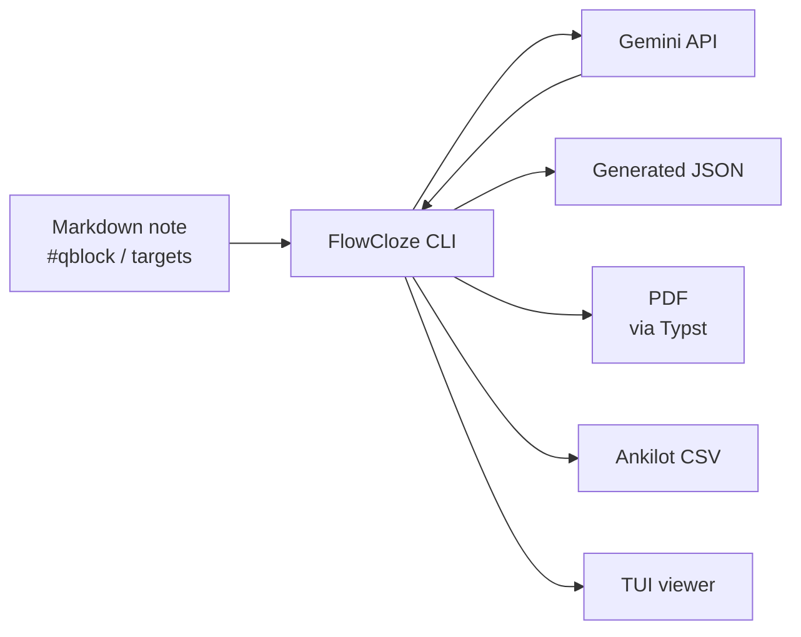

# FlowCloze

[日本語](README.md) | English

FlowCloze is a local CLI tool that generates context cloze questions from study notes written in Markdown.

You can keep your notes readable as normal Markdown, then wrap only the ranges you want to turn into questions with `#qblock{ ... }`. Terms that should become answers are marked as `[answer]{type}`. FlowCloze converts those annotations into intermediate JSON, generates questions with Gemini, validates the generated output, and can render the result as a Typst PDF.

```text
Markdown note
  -> qblock / target extraction
  -> intermediate JSON
  -> Gemini question generation
  -> generated JSON validation
  -> Typst PDF
```

## Background

When studying for exams, I often used two approaches:

1. Markdown notes
2. Handmade memorization sheets (Excel to PDF)

Markdown notes are easy to write while reading source material, and they are convenient to review later. However, I sometimes ended up remembering ideas only at a high level, which made it harder to answer questions that asked for specific terms or definitions.

The second approach was to create my own **context cloze questions** by turning important terms into blanks. I entered those questions into Excel, formatted them as memorization sheets, exported them as PDFs, and imported them into a note-taking app. I preferred context cloze questions over simple flashcards because the surrounding sentence helps recall the meaning and definition of each term.

The problem was that this workflow required not only writing the questions, but also copying them into Excel and formatting the final PDF. A lot of effort was spent before the actual memorization work could even begin.

FlowCloze was built to combine the writing comfort of Markdown notes with the memorization benefits of context cloze questions.

## System Overview

FlowCloze extracts question ranges from Markdown notes, generates questions with an LLM, and validates the generated result. Generated questions can be saved as JSON, rendered as a PDF with Typst, or exported as CSV for Ankilot.



## Features

- Extracts `#qblock{ ... }` ranges from Markdown
- Uses only terms marked as `[answer]{type}` as answer targets
- Treats `# Heading 1` as the section title for generated JSON and PDF output
- Assigns qblock IDs automatically in `qblock-001` order
- Generates context cloze question JSON with the Gemini API
- Validates generated JSON against the intermediate JSON
- Lets you review generated questions in a TUI before output
- Renders A4 landscape PDFs with Typst in answer-page then question-page order
- Exports CSV that can be imported into Ankilot
- Includes a small VS Code syntax highlighting extension

## Setup

### Requirements

- Rust / Cargo
- Typst CLI, when using PDF output
- Gemini API key, when using the `generate` command

### Build and Install

```bash
cargo build --release
mkdir -p ~/.local/bin
ln -sfn "$PWD/target/release/flowcloze" ~/.local/bin/flowcloze
```

If `~/.local/bin` is not in your `PATH`, add it in your shell configuration.

Check the installation with:

```bash
flowcloze --version
cargo test
```

For a simple debug build, you can also run:

```bash
cargo build
```

The command examples below assume that you have created the symbolic link after a release build and can run FlowCloze as `flowcloze`. For a temporary local run, you can replace `flowcloze ...` with `cargo run -- ...`.

```bash
flowcloze sample/sample.md
```

### Gemini Settings

Create a `.env` file when generating questions with Gemini.

```bash
cp .env.example .env
```

```env
GEMINI_API_KEY=your_api_key_here
GEMINI_MODEL=gemini-2.5-flash
```

`GEMINI_MODEL` is optional. When omitted, FlowCloze uses `gemini-2.5-flash`.

You can also set these values directly as environment variables instead of using `.env`.

## Markdown Format

### qblock

Wrap the range you want to turn into questions with `#qblock{ ... }`.

```md
# Software Engineering Overview

#qblock{
- [QCD]{term-name} means [quality]{meaning}, [cost]{meaning}, and [delivery]{meaning}
}
```

Do not write qblock IDs manually. FlowCloze assigns IDs automatically in appearance order, such as `qblock-001` and `qblock-002`.

```md
#qblock{
- An [information system]{term-name} is a system in which people, machines, and computers cooperate to achieve a purpose.
}
```

### Targets

Write answer targets as `[answer]{type}`.

```md
[Requirements definition]{term-name} consists of [elicitation]{process}, [analysis]{process}, [specification]{process}, and [validation]{process}.
```

The text inside `[]` is the answer string, and the text inside `{}` is the question perspective. FlowCloze instructs Gemini not to use anything other than these targets as answers.

### Sections

Only Markdown level-1 headings are used as section titles in PDF output.

```md
# Requirements Definition
```

`##` and `###` headings can still be used to structure your notes, but they are not used as PDF section titles.

### Target Types

The following types can be used without warnings. A type describes the perspective from which the term should be questioned.

| type | Description |
|---|---|
| `term-name` | Ask for the term itself |
| `meaning` | Ask for a meaning, definition, property, or purpose |
| `process` | Ask for a procedure, step, action, or state change |
| `relation` | Ask for a structure, comparison, classification, relation, or correspondence |

Undefined types are still extracted, but they are reported in the intermediate JSON `warnings`.

## CLI Usage

### Parse Markdown

Print extracted qblock IDs and targets as text.

```bash
flowcloze sample/sample.md
```

### Write Intermediate JSON

Generate intermediate JSON from Markdown.

```bash
flowcloze --json -o sample/sample.json sample/sample.md
```

Omit `-o` to write to standard output.

```bash
flowcloze --json sample/sample.md
```

A normal parse with `-o` is treated as JSON output automatically.

```bash
flowcloze -o sample/sample.json sample/sample.md
```

### Generate Questions

Generate context cloze questions with Gemini. After generation, FlowCloze validates the generated JSON against the intermediate JSON and saves only valid output.

```bash
flowcloze generate -o sample/sample.gemini.json sample/sample.md
```

You can enter additional constraints during `generate`. Finish input with an empty line.

Skip additional constraint input:

```bash
flowcloze generate -s -o sample/sample.gemini.json sample/sample.md
```

Specify a model explicitly:

```bash
flowcloze generate --model gemini-2.5-flash -o sample/sample.gemini.json sample/sample.md
```

### Validate Generated JSON

Validate intermediate JSON and generated JSON manually.

```bash
flowcloze validate sample/sample.json sample/sample.gemini.json
```

On success, FlowCloze prints `validation ok`. On failure, it prints validation errors and exits with status code `1`.

### View Generated JSON

Review generated JSON in the TUI.

```bash
flowcloze view sample/sample.gemini.json
```

### Export Ankilot CSV

Export generated JSON as CSV for Ankilot import. The CSV is UTF-8, has no header, and contains two columns.

1. Front: question
2. Back: answers

```bash
flowcloze csv -o sample/sample.csv sample/sample.gemini.json
```

Omit `-o` to write to standard output.

### Build PDF

Create a PDF from generated JSON. By default, FlowCloze uses `templates/cloze.typ` and writes a `.pdf` next to the input JSON.

```bash
flowcloze pdf sample/sample.gemini.json
```

You can specify an output path and template.

```bash
flowcloze pdf -o sample/sample.pdf --template templates/cloze.typ sample/sample.gemini.json
```

The PDF outputs each page in answer then question order. Answer pages show answers in red, and question pages replace the same positions with blanks.

### Help and Version

```bash
flowcloze --help
flowcloze --version
```

### API Settings

Save a Gemini API key to `.env`. The model is optional.

```bash
flowcloze api set --key your_api_key_here
```

Update the model:

```bash
flowcloze api set --key your_api_key_here --model gemini-2.5-flash
```

## JSON Shapes

Intermediate JSON contains only facts extracted from Markdown.

```json
{
  "meta": {
    "source": "sample/sample.md"
  },
  "qblocks": [
    {
      "id": "qblock-001",
      "section": "Requirements Definition",
      "source_text": "Requirements definition is the process of creating a requirements specification from what the customer wants.",
      "targets": [
        { "answer": "Requirements definition", "type": "term-name" },
        { "answer": "requirements specification", "type": "relation" }
      ]
    }
  ]
}
```

Generated JSON is the format read by the Typst template and validator.

```json
{
  "questions": [
    {
      "id": "qblock-001",
      "section": "Requirements Definition",
      "type": "context-cloze",
      "targets": [
        { "answer": "Requirements definition", "type": "term-name" },
        { "answer": "requirements specification", "type": "relation" }
      ],
      "question": "_____ is the process of creating a _____ from what the customer wants.",
      "answers": ["Requirements definition", "requirements specification"],
      "source_text": "Requirements definition is the process of creating a requirements specification from what the customer wants.",
      "explanation": "",
      "tags": [],
      "warnings": []
    }
  ]
}
```

## Editor Support

`editors/vscode-flowcloze-syntax` contains a small VS Code extension that highlights `#qblock` and `[answer]{type}` syntax.

### Local Install

When using VS Code on WSL, create a symbolic link in the VS Code Server extension directory.

```sh
mkdir -p ~/.vscode-server/extensions
ln -sfn "$PWD/editors/vscode-flowcloze-syntax" ~/.vscode-server/extensions/flowcloze.flowcloze-syntax-0.0.1
```

Then run `Developer: Reload Window` in VS Code and open a Markdown file such as `sample/sample.md`.

For non-WSL Linux environments, use `~/.vscode/extensions` instead.

```sh
mkdir -p ~/.vscode/extensions
ln -sfn "$PWD/editors/vscode-flowcloze-syntax" ~/.vscode/extensions/flowcloze.flowcloze-syntax-0.0.1
```

## Repository Layout

```text
src/parser.rs      Markdown qblock parser
src/json.rs        intermediate JSON conversion
src/prompt.rs      Gemini prompt builder
src/gemini.rs      Gemini API client
src/validation.rs  generated JSON validator
src/csv.rs         Ankilot CSV exporter
src/pdf.rs         Typst PDF adapter
templates/         Typst templates
sample/            sample note and outputs
tests/             parser / JSON / validation tests
```

## Development

This program is developed with vibe coding. If you find a bug or serious issue while using it, please open an Issue. If you can fix it, create a branch, make the change, and send a Pull Request. Contributions are welcome.

## License

Licensed under either of Apache License, Version 2.0 or MIT license at your option.
