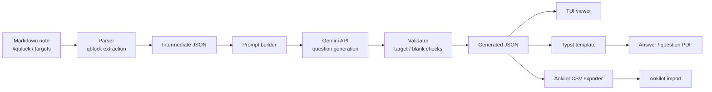

# FlowCloze

FlowClozeは，Markdownで書いた学習ノートから文章補完問題を生成するローカルCLIツールです。

ノート本文はそのまま読み物として保ち，問題にしたい範囲だけを `#qblock{ ... }` で囲みます。答えにしたい語句は `[答え]{type}` として明示します。FlowClozeはその指定を中間JSONへ変換し，Geminiによる問題文生成，生成結果の検証，TypstによるPDF化までを扱います。

```text
Markdown note
  -> qblock / target extraction
  -> intermediate JSON
  -> Gemini question generation
  -> generated JSON validation
  -> Typst PDF
```
## Background

試験などの勉強をするとき，ノートにまとめたり暗記シートを作成したりすると思います．もれなく私もその一人なのですが，今まで次のような手法で勉強してました．

1. Markdown式ノート
2. お手製暗記シート(EXCEL-PDF)

1については，表記の通りで資料をみつつ，自分の言葉でまとめていくスタイルです．この方法は後から見返しやすいですが，抽象的に覚えてしまうところもあり，具体的な単語や定義を聞かれた際に対応できなくなることが多いです．

2については，資料を読みながら要点を整理し，覚えたい語句を空欄にした**文章補完問題**を自分で作る方法です．作成した問題はEXCELに入力して暗記シートの形に整え，PDFとして出力したあと，ノートアプリに取り込んで使っていました．1問1答ではなく文章補完問題にしていたのは，前後の文脈から語句の定義や意味を思い出せるため，単語だけを切り出して覚えるよりも印象に残りやすかったからです．しかし，この方法では問題文を考える作業に加えて，EXCELへ転記し，PDFとして使える形に整える作業も必要になります．そのため，実際に暗記を始める前の準備段階でかなりのリソースを使ってしまっていました．

そのため，私は，1と2の方法の良いところどりをできないか考えました．その結果がこのプログラムというわけです．

## Systems
前述した通り，このプログラムはノート本文から問題範囲を抽出し，LLMによって問題文を生成し，検証します．また，Typstを用いてPDFに出力したり，Ankilotに組み込む用のCSVを出力することができます．以下，システム構成を示します．




## Features

- Markdown内の `#qblock{ ... }` を問題化範囲として抽出
- `[答え]{type}` で指定した語句だけを解答対象にする
- `# 見出し1` を単元名として扱い，生成JSONとPDFに反映
- qblock IDは出現順に `qblock-001` 形式で自動採番
- Gemini APIで文章補完問題JSONを生成
- 中間JSONと生成JSONを照合し，余分な答えや空欄数のずれを検出
- Typstで「解答ページ -> 問題ページ」の順にA4横PDFを出力
- VS Code用の簡易シンタックスハイライト拡張を同梱

## Setup

必要なもの:

- Rust / Cargo
- Typst CLI
- Gemini API key（`generate` を使う場合）

ビルドとテスト:

```bash
cargo build
cargo test
```

普段のシェルから `flowcloze` として実行したい場合は、releaseビルドしたバイナリにシンボリックリンクを張ります。

```bash
cargo build --release
mkdir -p ~/.local/bin
ln -sfn "$PWD/target/release/flowcloze" ~/.local/bin/flowcloze
```

`~/.local/bin` が `PATH` に入っていない場合は、シェル設定に追加してください。

Geminiを使う場合は `.env` を用意します。

```bash
cp .env.example .env
```

```env
GEMINI_API_KEY=your_api_key_here
GEMINI_MODEL=gemini-2.5-flash
```

`GEMINI_MODEL` は省略できます。未指定時は `gemini-2.5-flash` を使います。

## Markdown Format

### qblock

問題化したい範囲を `#qblock{ ... }` で囲みます。

```md
# ソフトウェア工学の概論

#qblock{
- [QCD]{term-name}は[品質]{meaning}，[コスト]{meaning}，[納期]{meaning}
}
```

qblock IDは書きません。出現順に `qblock-001`，`qblock-002` のようなIDが自動で付きます。

```md
#qblock{
- [情報システム]{term-name}は，人，機械，コンピュータが協調して目的を達成する仕組みである。
}
```

### targets

答えにしたい語句は `[答え]{type}` で書きます。

```md
[要求定義]{term-name}は，[要求獲得]{process}，[要求分析]{process}，[要求仕様化]{process}，[検証]{process}からなる。
```

`[]` の中が解答文字列，`{}` の中が出題観点です。Geminiには，ここで指定したtargets以外を答えにしないよう指示します。

### sections

PDF上の単元見出しとして使うのはMarkdownの見出し1だけです。

```md
# 要求定義
```

`##` や `###` はノート内の構造として残せますが，PDFの単元見出しには使いません。

### target types

現在，警告なしで使えるtypeは以下です。typeは「その語句をどの観点で問いたいか」を示すラベルです。

| type | 説明 |
|---|---|
| `term-name` | 用語名そのものを問う |
| `meaning` | 意味，定義，性質，目的などを問う |
| `process` | 手順，工程，動作，状態変化などを問う |
| `relation` | 構成，比較，分類，関係，対応などを問う |

未定義typeも抽出されますが，中間JSONの `warnings` に警告が付きます。

## CLI

### Parse Markdown

抽出されたqblock IDとtargetsをテキストで確認します。

```bash
cargo run -- notes/sample.md
```

### Write Intermediate JSON

Markdownから中間JSONを生成します。

```bash
cargo run -- --json -o generated/sample.questions.json notes/sample.md
```

`-o` を省略すると標準出力へ出します。

```bash
cargo run -- --json notes/sample.md
```

`-o` を指定した通常parseは，自動的にJSON出力として扱われます。

```bash
cargo run -- -o generated/sample.questions.json notes/sample.md
```

### Generate Questions

Geminiで文章補完問題を生成します。生成後，FlowClozeは中間JSONと照合し，検証に通ったJSONだけを保存します。

```bash
cargo run -- generate -o generated/sample.gemini.json notes/sample.md
```

`generate` 実行時に追加制約を入力できます。空行で終了します。

追加制約の入力をスキップする場合:

```bash
cargo run -- generate -s -o generated/sample.gemini.json notes/sample.md
```

モデルを明示する場合:

```bash
cargo run -- generate --model gemini-2.5-flash -o generated/sample.gemini.json notes/sample.md
```

### Validate Generated JSON

中間JSONと生成JSONを手動で検証します。

```bash
cargo run -- validate generated/sample.questions.json generated/sample.gemini.json
```

成功時は `validation ok` を出力します。失敗時は検証エラーを表示して終了コード `1` で終了します。

### View Generated JSON

生成JSONをTUIで確認します。

```bash
cargo run -- view generated/sample.gemini.json
```

### Export Ankilot CSV

生成JSONからAnkilot取り込み用CSVを作ります。CSVはUTF-8のヘッダーなし2列形式です。

1. 表: question
2. 裏: answers

```bash
cargo run -- csv -o generated/sample.csv generated/sample.gemini.json
```

`-o` を省略すると標準出力へ出します。


### Build PDF

生成JSONからPDFを作ります。デフォルトでは `templates/cloze.typ` を使い，入力JSONと同じ場所に `.pdf` を出力します。

```bash
cargo run -- pdf generated/sample.gemini.json
```

出力先やテンプレートを指定できます。

```bash
cargo run -- pdf -o generated/sample.pdf --template templates/cloze.typ generated/sample.gemini.json
```

PDFは各ページを「解答」「問題」の順に出力します。解答ページには答えを赤字で表示し，問題ページでは同じ位置を空欄にします。

### Help / Version

ヘルプとバージョンを表示します。

```bash
cargo run -- --help
cargo run -- --version
```


### API Settings

Gemini APIキーを `.env` に保存します。モデル指定は省略できます。

```bash
cargo run -- api set --key your_api_key_here
```

モデルを更新する場合:

```bash
cargo run -- api set --key your_api_key_here --model gemini-2.5-flash
```

## JSON Shapes

中間JSONは，Markdownから抽出した事実だけを保持します。

```json
{
  "meta": {
    "source": "notes/sample.md"
  },
  "qblocks": [
    {
      "id": "qblock-001",
      "section": "要求定義",
      "source_text": "要求定義は，「顧客が欲しいモノ」から要求仕様書をまとめる工程である。",
      "targets": [
        { "answer": "要求定義", "type": "term-name" },
        { "answer": "要求仕様書", "type": "relation" }
      ]
    }
  ]
}
```

生成JSONは，Typstテンプレートと検証器が読む形式です。

```json
{
  "questions": [
    {
      "id": "qblock-001",
      "section": "要求定義",
      "type": "context-cloze",
      "targets": [
        { "answer": "要求定義", "type": "term-name" },
        { "answer": "要求仕様書", "type": "relation" }
      ],
      "question": "＿＿＿は，顧客が欲しいモノから＿＿＿をまとめる工程である。",
      "answers": ["要求定義", "要求仕様書"],
      "source_text": "要求定義は，「顧客が欲しいモノ」から要求仕様書をまとめる工程である。",
      "explanation": "",
      "tags": [],
      "warnings": []
    }
  ]
}
```

## Editor Support

`editors/vscode-flowcloze-syntax` に，`#qblock` と `[答え]{type}` を見やすくするVS Code用の簡易拡張があります。

### Install Locally

WSL上のVS Codeを使用している場合は、VS Code Serverの拡張ディレクトリにシンボリックリンクを作成します。

```sh
mkdir -p ~/.vscode-server/extensions
ln -sfn "$PWD/editors/vscode-flowcloze-syntax" ~/.vscode-server/extensions/flowcloze.flowcloze-syntax-0.0.1
```

その後、VS Codeで `Developer: Reload Window` を実行し、`notes/sample.md` などのMarkdownファイルを開いてください。

WSL以外のLinux環境の場合は、代わりに `~/.vscode/extensions` を使用します。

```sh
mkdir -p ~/.vscode/extensions
ln -sfn "$PWD/editors/vscode-flowcloze-syntax" ~/.vscode/extensions/flowcloze.flowcloze-syntax-0.0.1
```

## Repository Layout

```text
src/parser.rs      Markdown qblock parser
src/json.rs        intermediate JSON conversion
src/prompt.rs      Gemini prompt builder
src/gemini.rs      Gemini API client
src/validation.rs  generated JSON validator
src/pdf.rs         Typst PDF adapter
templates/         Typst templates
notes/             sample notes
generated/         sample outputs
tests/             parser / JSON / validation tests
```

## License

Licensed under either of Apache License, Version 2.0 or MIT license at your option.
