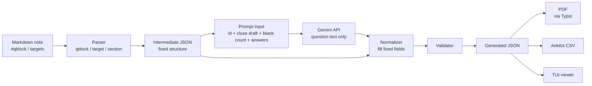
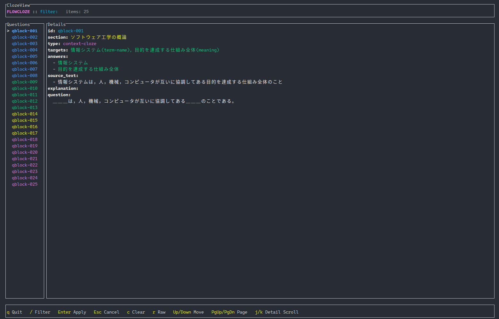

# FlowCloze

日本語 | [English](README.en.md)

FlowClozeは，Markdownで書いた学習ノートから文章補完問題を生成するCLIツールです．

ノート本文はそのまま読み物として残し，問題にしたい範囲だけを `#qblock{ ... }` で囲みます．答えにしたい語句は `[答え]` として明示します．FlowClozeはその指定を中間JSONへ変換し，Geminiには断片的な文を1つの文章補完問題本文へ整える作業だけを任せます．解答・target・section・source_text・段落境界などの固定情報はRust側で組み立て，検証した上でPDF化します．

```text
Markdown note
  -> qblock / target extraction
  -> intermediate JSON
  -> Gemini edits question text only
  -> generated JSON normalization
  -> validation
  -> Typst PDF
```

## 背景

試験などの勉強をするとき，ノートにまとめたり暗記シートを作成したりすると思います．私もこれまで，主に次の2つの方法で勉強していました．

1. Markdown形式のノート
2. 手作りの暗記シート（EXCEL-PDF）

1つ目は，資料を読みながら内容を自分の言葉でまとめていく方法です．後から見返しやすい一方で，内容を抽象的に覚えてしまい，具体的な用語や定義を問われたときに対応しづらいことがありました．

2つ目は，資料を読みながら要点を整理し，覚えたい語句を空欄にした**文章補完問題**を自分で作る方法です．作成した問題はEXCELに入力して暗記シートの形に整え，PDFとして出力したあと，ノートアプリに取り込んで使っていました．1問1答ではなく文章補完問題にしていたのは，前後の文脈から語句の定義や意味を思い出せるため，単語だけを切り出して覚えるよりも印象に残りやすかったからです．

ただし，この方法では問題文を考えるだけでなく，EXCELへ転記し，PDFとして使える形に整える作業も必要になります．その結果，実際に暗記を始める前の準備段階でかなりのリソースを使ってしまっていました．

そこで，Markdownノートの書きやすさと，文章補完問題の覚えやすさを両立できないかと考えました．そのために作ったのがFlowClozeです．

## システム構成
FlowClozeは，Markdownノートから問題範囲と解答対象を抽出し，中間JSONを作ります．Geminiには中間JSONを丸ごと渡さず，`id`，`cloze_template`，`blank_count`，`answers` だけを含む薄い入力を渡します．Geminiは「元の文章」と「穴埋め下書き」を見て，answerを空欄へ戻したときにも自然な `question` 本文だけを生成します．その後，FlowClozeが中間JSONをもとに生成JSON全体を正規化し，空欄数・解答順・段落境界を検証します．生成した問題はJSONとして保存できるほか，TypstによるPDF出力や，Ankilotへ取り込むためのCSV出力にも対応しています．

システム構成は次の通りです．


```mermaid
flowchart LR
    note[Markdown note<br/>#qblock / targets] --> parse[Parser<br/>qblock / target / section]
    parse --> intermediate[Intermediate JSON<br/>fixed structure]
    intermediate --> prompt[Prompt input<br/>id + cloze draft + blank count + answers]
    prompt --> gemini[Gemini API<br/>question text only]
    gemini --> normalize[Normalizer<br/>fill fixed fields]
    intermediate --> normalize
    normalize --> validate[Validator]
    validate --> json[Generated JSON]
    json --> pdf[PDF<br/>via Typst]
    json --> csv[Ankilot CSV]
    json --> tui[TUI viewer]
```

## 主な機能

主な機能は次の通りです．

- Markdown内の `#qblock{ ... }` を問題化範囲として抽出
- `[答え]` または `[答え]{type}` で指定した語句だけを解答対象にする
- 直近のMarkdown見出し，またはqblock内の先頭 `# 見出し1` を単元名として扱い，生成JSONとPDFに反映
- qblock IDは出現順に `qblock-001` 形式で自動採番
- Gemini APIで断片的なノート文を1つの文章補完問題本文へ編集
- 中間JSONから `section` / `targets` / `answers` / `source_text` を決定的に組み立て
- 中間JSONと生成JSONを照合し，空欄数・解答順・段落境界のずれを検出
- 出力前に，TUI上で生成された問題を確認可能
- Typstで「解答ページ -> 問題ページ」の順にA4横PDFを出力
- AnkilotにインポートできるようCSV出力に対応
- VS Code用の簡易シンタックスハイライト拡張を同梱

## セットアップ

### 必要なもの

- Rust / Cargo
- Typst CLI（PDF出力を使う場合）
- Gemini API key（`generate` コマンドを使う場合）

### ビルドとインストール

```bash
cargo build --release
mkdir -p ~/.local/bin
ln -sfn "$PWD/target/release/flowcloze" ~/.local/bin/flowcloze
```

`~/.local/bin` が `PATH` に入っていない場合は，シェル設定に追加してください．

動作確認には次のコマンドを使います．

```bash
flowcloze --version
cargo test
```

ビルドだけ確認したい場合は，通常のdebugビルドも使えます．

```bash
cargo build
```

このREADMEでは，以降のコマンド例はreleaseビルド後にシンボリックリンクを作成し，`flowcloze` コマンドとして実行できる前提で書いています．ローカルで一時的に試すだけなら，`flowcloze ...` の代わりに `cargo run -- ...` でも実行できます．

```bash
flowcloze sample/sample.md
```

## Markdown形式

### qblock指定

問題化したい範囲を `#qblock{ ... }` で囲みます．

```md
# ソフトウェア工学の概論

#qblock{
- [QCD]{term-name}は[品質]{meaning}，[コスト]{meaning}，[納期]{meaning}
}
```

qblock IDは書きません．出現順に `qblock-001`，`qblock-002` のようなIDが自動で付きます．

```md
#qblock{
- [情報システム]{term-name}は，人，機械，コンピュータが協調して目的を達成する仕組みである．
}
```

### target指定

答えにしたい語句は `[答え]` で書きます．必要な場合は `[答え]{type}` として出題観点を明示できます．

```md
[要求定義]は，[要求獲得]，[要求分析]，[要求仕様化]，[検証]からなる．
```

`[]` の中が解答文字列です．`{}` を付けた場合は出題観点として扱います．typeを省略した場合は `term-name` として扱います．targetとanswersはRust側で中間JSONから生成JSONへコピーされるため，Geminiは解答対象を推測しません．

### 単元見出し

PDF上の単元見出しには，qblock直前の `# 見出し1`，またはqblock内の先頭 `# 見出し1` を使います．`##` や `###` はsectionにはしません．

```md
# 要求定義
```

qblock内の `##` や `###` は，単元見出しではなく段落境界として扱います．見出し名そのものは生成対象の本文には含めません．

### target type一覧

typeは任意です．指定する場合，現在，警告なしで使えるtypeは以下です．typeは「その語句をどの観点で問いたいか」を示すラベルです．

| type | 説明 |
|---|---|
| `term-name` | 用語名そのものを問う |
| `meaning` | 意味，定義，性質，目的などを問う |
| `process` | 手順，工程，動作，状態変化などを問う |
| `relation` | 構成，比較，分類，関係，対応などを問う |

未定義typeも抽出されますが，中間JSONの `warnings` に警告が付きます．

## CLIの使い方

### API設定

`generate`コマンドを使用するためには，Gemini APIキーを `.env` に保存します．モデル指定は省略できます．

```bash
flowcloze api set --key your_api_key_here
```

モデルを更新する場合:

```bash
flowcloze api set --key your_api_key_here --model gemini-2.5-flash
```


### Markdownを解析する

抽出されたqblock IDとtargetsをテキストで確認します．

```bash
flowcloze sample/sample.md
```

### 中間JSONを書き出す

Markdownから中間JSONを生成します．

```bash
flowcloze --json -o sample/sample.json sample/sample.md
```

`-o` を省略すると標準出力へ出します．

```bash
flowcloze --json sample/sample.md
```

`-o` を指定した通常parseは，自動的にJSON出力として扱われます．

```bash
flowcloze -o sample/sample.json sample/sample.md
```

### 問題を生成する

Geminiで `question` 本文を生成します．Geminiが返すのは各qblockの `id` と `question` だけです．その後，FlowClozeが中間JSONから `section` / `type` / `targets` / `answers` / `source_text` を補完し，生成JSONとして正規化します．検証に失敗した場合は，検証エラーをGeminiに渡して最大3回まで再生成します．

```bash
flowcloze generate -o sample/sample.json sample/sample.md
```

`generate` 実行時に追加制約を入力できます．空行で終了します．

追加制約の入力をスキップする場合:

```bash
flowcloze generate -s -o sample/sample.json sample/sample.md
```

モデルを明示する場合:

```bash
flowcloze generate --model gemini-2.5-flash -o sample/sample.json sample/sample.md
```

### 生成JSONを検証する

中間JSONと生成JSONを手動で検証します．中間JSONと生成JSONは別ファイルとして保存しておくと確認しやすくなります．

```bash
flowcloze --json -o sample/intermediate.json sample/sample.md
flowcloze validate sample/intermediate.json sample/sample.json
```

成功時は `validation ok` を出力します．失敗時は検証エラーを表示して終了コード `1` で終了します．

### 生成JSONを表示する

生成JSONをTUIで確認することができます．

```bash
flowcloze view sample/sample.json
```



### Ankilot CSVを書き出す

生成JSONからAnkilot取り込み用CSVを作ります．CSVはUTF-8のヘッダーなし2列形式です．

1. 表: question
2. 裏: answers

```bash
flowcloze csv -o sample/sample.csv sample/sample.json
```

`-o` を省略すると標準出力へ出します．


### PDFを作成する

生成JSONからPDFを作ります．デフォルトでは `templates/cloze.typ` を使い，入力JSONと同じ場所に `.pdf` を出力します．

```bash
flowcloze pdf sample/sample.json
```

出力先やテンプレートを指定できます．

```bash
flowcloze pdf -o sample/sample.pdf --template templates/cloze.typ sample/sample.json
```

PDFは各ページを「解答」「問題」の順に出力します．解答ページには答えを赤字で表示し，問題ページでは同じ位置を空欄にします．

### ヘルプとバージョン

ヘルプとバージョンを表示します．

```bash
flowcloze --help
flowcloze --version
```


## JSON形式

中間JSONは，Markdownから抽出したqblockの事実を保持するRust側の生成タスクです．
空欄位置，解答順，段落境界，単元見出しはRust側で確定します．
`cloze_template` は「元の文章」と「穴埋め下書き」を含みます．Geminiにはこの中間JSONを丸ごと渡さず，`id`，`cloze_template`，`blank_count`，`answers` だけを抽出したGemini用入力を渡します．`answers` は空欄を戻したときの文法確認にだけ使わせ，生成JSONの構造管理には使いません．

```json
{
  "schema_version": 3,
  "meta": {
    "source": "sample/sample.md",
    "format": {
      "blank": "＿＿＿",
      "block_separator": "\n\n",
      "paragraph_indent": "　"
    }
  },
  "tasks": [
    {
      "id": "qblock-001",
      "type": "context-cloze",
      "section": "要求定義",
      "source": {
        "raw": "[要求定義]{term-name}は，「顧客が欲しいモノ」から[要求仕様書]{relation}をまとめる工程である．",
        "plain": "要求定義は，「顧客が欲しいモノ」から要求仕様書をまとめる工程である．"
      },
      "blocks": [
        {
          "id": "qblock-001-b001",
          "kind": "paragraph",
          "starts_new_paragraph": false,
          "text": "要求定義は，「顧客が欲しいモノ」から要求仕様書をまとめる工程である．",
          "cloze_text": "　＿＿＿は，「顧客が欲しいモノ」から＿＿＿をまとめる工程である．",
          "target_refs": [0, 1]
        }
      ],
      "cloze_template": "元の文章:\n要求定義は，「顧客が欲しいモノ」から要求仕様書をまとめる工程である．\n\n穴埋め下書き:\n　＿＿＿は，「顧客が欲しいモノ」から＿＿＿をまとめる工程である．",
      "targets": [
        { "index": 0, "answer": "要求定義", "type": "term-name", "block_id": "qblock-001-b001" },
        { "index": 1, "answer": "要求仕様書", "type": "relation", "block_id": "qblock-001-b001" }
      ],
      "answers": ["要求定義", "要求仕様書"]
    }
  ]
}
```

Geminiへ実際に渡す入力は，概念的には次の最小形です．`meta`，`source`，`blocks`，`targets` は含めません．

```json
{
  "tasks": [
    {
      "id": "qblock-001",
      "cloze_template": "元の文章:\n要求定義は，「顧客が欲しいモノ」から要求仕様書をまとめる工程である．\n\n穴埋め下書き:\n　＿＿＿は，「顧客が欲しいモノ」から＿＿＿をまとめる工程である．",
      "blank_count": 2,
      "answers": ["要求定義", "要求仕様書"]
    }
  ]
}
```

Geminiからの生出力は，概念的には次の最小JSONです．

```json
{
  "questions": [
    {
      "id": "qblock-001",
      "question": "＿＿＿は，顧客が欲しいモノから＿＿＿をまとめる工程である．"
    }
  ]
}
```

FlowClozeはこの出力を中間JSONと照合し，最終的な生成JSONへ正規化します．生成JSONは，Typstテンプレートと検証器が読む形式です．

```json
{
  "questions": [
    {
      "id": "qblock-001",
      "section": "要求定義",
      "type": "context-cloze",
      "targets": [
        { "answer": "要求定義", "type": "term-name" },
        { "answer": "要求仕様書", "type": "relation" }
      ],
      "question": "＿＿＿は，顧客が欲しいモノから＿＿＿をまとめる工程である．",
      "answers": ["要求定義", "要求仕様書"],
      "source_text": "要求定義は，「顧客が欲しいモノ」から要求仕様書をまとめる工程である．",
      "explanation": "",
      "tags": [],
      "warnings": []
    }
  ]
}
```

## 責務分担

現在の生成フローでは，GeminiにJSON全体の正しさを任せません．各部分の責務は次の通りです．

- `parser.rs`: Markdownから `#qblock`，target，section，target位置を抽出する
- `json.rs`: 中間JSONを作る．`blocks`，`cloze_text`，`cloze_template`，`targets`，`answers` を確定する
- `prompt.rs`: 中間JSONから `id` / `cloze_template` / `blank_count` / `answers` だけを抽出し，Geminiへ「question本文だけを編集する」ための短い指示を作る
- `gemini.rs`: Gemini APIを呼び，`id` と `question` の最小JSONを受け取る
- `main.rs`: Gemini出力を中間JSONで正規化し，`section` / `type` / `targets` / `answers` / `source_text` / 段落境界を補完する
- `validation.rs`: 空欄数，解答順，target対応，段落境界を検証する
- `templates/cloze.typ`: 生成JSONからPDFを組版する

## 現在の設計詳細

### 基本方針

FlowClozeでは，LLMに構造化データの正しさを任せない設計にしています．Geminiの責務は，qblock内のバラバラなノート文を，1つの自然な文章補完問題の本文へ編集することだけです．

次の情報はRust側で決定します．

- qblock ID
- section
- target一覧
- answers配列
- source_text
- 空欄の数
- 解答順
- 段落境界
- PDF上の解答欄

Geminiへ送る入力は，実質的に `id`，`cloze_template`，`blank_count`，`answers` だけです．Geminiが返すJSONは `id` と `question` だけです．最終的な生成JSONは，Gemini出力を中間JSONで正規化して作ります．

### Markdown解析

Markdownでは，問題化したい範囲を `#qblock{ ... }` で囲みます．qblockの中にある `[答え]` または `[答え]{type}` がtargetです．

sectionは次の優先順で決まります．

1. qblock直前の `# 見出し1`
2. qblock内の先頭 `# 見出し1`
3. どちらもなければ空文字列

`##` や `###` はsectionにはしません．qblock内の `##` / `###` は段落境界として扱います．見出し文字列そのものは `blocks[].text` や `blocks[].cloze_text` には含めません．

### 中間JSON

中間JSONは，Markdownから抽出した事実を保持するRust側の生成タスクです．主なフィールドの役割は次の通りです．Geminiへ渡すための入力ではなく，後段の正規化と検証で使う完全な基準データです．

- `schema_version`: 中間JSONのバージョン
- `meta.source`: 元Markdownファイルのパス
- `meta.format.blank`: 空欄文字列．現在は `＿＿＿`
- `meta.format.block_separator`: block結合時の区切り．現在は `\n\n`
- `meta.format.paragraph_indent`: 段落先頭の字下げ．現在は全角スペース
- `tasks[]`: qblockごとの生成タスク
- `tasks[].id`: `qblock-001` 形式のID
- `tasks[].section`: PDFや表示で使う単元名
- `tasks[].source.raw`: target markup付きの元本文
- `tasks[].source.plain`: target markupを外した本文
- `tasks[].blocks[]`: 段落単位の構造
- `blocks[].text`: target markupを外したblock本文
- `blocks[].cloze_text`: target部分を `＿＿＿` に置換したblock本文
- `blocks[].starts_new_paragraph`: このblockの前に段落境界を置くかどうか
- `blocks[].target_refs`: block内に含まれるtarget index
- `tasks[].cloze_template`: Gemini用入力へ抽出する「元の文章」と「穴埋め下書き」
- `tasks[].targets`: index，answer，type，block_idを持つtarget一覧
- `tasks[].answers`: target順に並べたanswer文字列

`cloze_template` は次の形です．

```text
元の文章:
...

穴埋め下書き:
...
```

Gemini用入力は，中間JSONから次の4項目だけを取り出して作ります．

```json
{
  "tasks": [
    {
      "id": "qblock-001",
      "cloze_template": "元の文章:\n...\n\n穴埋め下書き:\n...",
      "blank_count": 2,
      "answers": ["要求定義", "要求仕様書"]
    }
  ]
}
```

Geminiは「元の文章」で文脈を読み，「穴埋め下書き」の空欄数と順序を保ったまま，question本文だけを整えます．`blank_count` は，question内の `＿＿＿` の数を合わせるためのチェック情報です．`answers` は，空欄へ戻したときに体言止めや語尾欠落にならないかを確認するための補助情報です．

### Geminiプロンプト

Geminiへの指示は短く保っています．現在のプロンプトで強調しているのは次の点です．

- Geminiの責務はquestion本文の編集だけ
- Geminiへ渡すJSONには `id` / `cloze_template` / `blank_count` / `answers` だけを含める
- `section` / `type` / `targets` / `answers` / `source_text` はRust側で補完する
- `＿＿＿` の数と順序を変えない
- `＿＿＿` に対応する答え語句をquestion本文に残さない
- targetでない説明・条件・例・比較はなるべく残す
- 常体（だ・である調）で書く
- 各段落は全角スペースで始める
- 元ノートにない知識は足さない

Geminiから期待する生出力は次の最小形です．

```json
{
  "questions": [
    {
      "id": "qblock-001",
      "question": "　＿＿＿は，顧客が欲しいモノから＿＿＿をまとめる工程である．"
    }
  ]
}
```

### 生成JSON正規化

Geminiの生出力はそのまま保存しません．`main.rs` の正規化処理で，中間JSONをもとに最終的な生成JSONへ変換します．

正規化で行うことは次の通りです．

- `tasks` の順序に合わせて `questions` を並べ直す
- `id` は中間JSONの `task.id` を使う
- `section` は中間JSONの `task.section` を使う
- `type` は `context-cloze` にする
- `targets` は中間JSONの `targets` から `answer` と `type` だけをコピーする
- `answers` は中間JSONの `answers` をコピーする
- `source_text` は中間JSONの `source.plain` をコピーする
- `question` だけGemini出力を使う
- `##` / `###` 由来の段落境界が不足していれば，対応する空欄の前に `\n\n` を補う
- `。　次段落` のように全角スペースだけで段落が始まっている場合は，`。\n\n　次段落` に直す
- 各段落の先頭に全角スペースがなければ付与する

このため，Geminiが `targets` や `answers` を返さなくても，最終生成JSONには必ず中間JSON由来の値が入ります．

### 検証

検証器は，中間JSONと生成JSONを照合します．主に次を確認します．

- qblockごとのquestionが存在するか
- questionが空でないか
- `＿＿＿` の数と `answers` の数が一致するか
- targetがあるのに空欄がない生成結果になっていないか
- `answers` の順序が中間JSONと一致するか
- `answers` にtarget外の語句が混ざっていないか
- targetが `answers` から抜けていないか
- 必要な段落改行数が満たされているか

検証に失敗した場合，`generate` は検証エラーをGeminiへ返し，最大3回まで再生成します．

### PDF出力

PDFは `templates/cloze.typ` で組版します．生成JSONの `questions[]` を読み，解答ページと問題ページを交互に出力します．

PDF表示の現在の方針は次の通りです．

- sectionが変わったときだけ見出し帯を表示する
- question本文はJSON内の改行を反映する
- 段落間の余分な空白は作らず，全角スペースで段落開始を示す
- 解答ページでは `answers` を赤字で表示する
- 問題ページでは同じ位置を空欄として表示する
- 長い解答は文字サイズと欄の高さを調整して収める

### 設計上の意図

この設計の狙いは，LLMの自由生成を文章編集に限定し，構造化データの正しさをRust側で担保することです．

Geminiに任せると揺れやすいもの，たとえば `targets`，`answers`，section，source_text，解答順は中間JSONから機械的に作ります．一方で，箇条書きや断片的なメモを自然な文章補完問題に整える部分だけはGeminiに任せます．

## エディタサポート

`editors/vscode-flowcloze-syntax` に，`#qblock` と `[答え]` / `[答え]{type}` を見やすくするVS Code用の簡易拡張があります．

### ローカルにインストールする

WSL上のVS Codeを使用している場合は，VS Code Serverの拡張ディレクトリにシンボリックリンクを作成します．

```sh
mkdir -p ~/.vscode-server/extensions
ln -sfn "$PWD/editors/vscode-flowcloze-syntax" ~/.vscode-server/extensions/flowcloze.flowcloze-syntax-0.0.1
```

その後，VS Codeで `Developer: Reload Window` を実行し，`sample/sample.md` などのMarkdownファイルを開いてください．

WSL以外のLinux環境の場合は，代わりに `~/.vscode/extensions` を使用します．

```sh
mkdir -p ~/.vscode/extensions
ln -sfn "$PWD/editors/vscode-flowcloze-syntax" ~/.vscode/extensions/flowcloze.flowcloze-syntax-0.0.1
```

## リポジトリ構成

```text
src/parser.rs      Markdown qblockパーサ
src/json.rs        中間JSON変換
src/prompt.rs      Geminiプロンプト生成
src/gemini.rs      Gemini APIクライアント
src/validation.rs  生成JSONバリデータ
src/csv.rs         Ankilot CSVエクスポータ
src/pdf.rs         Typst PDFアダプタ
templates/         Typstテンプレート
sample/            サンプルノートと出力例
tests/             パーサ / JSON / 検証のテスト
```

## 開発について

このプログラムの開発には，バイブコーディングを利用しています．そのため，利用中にバグや重大な問題を見つけた場合は，Issueに内容を書いてください．修正できる場合は，ブランチを切って変更を入れ，Pull Requestを送ってください．ご協力よろしくお願いします．

## ライセンス

Apache License, Version 2.0 または MIT license のいずれかを選択して利用できます．
