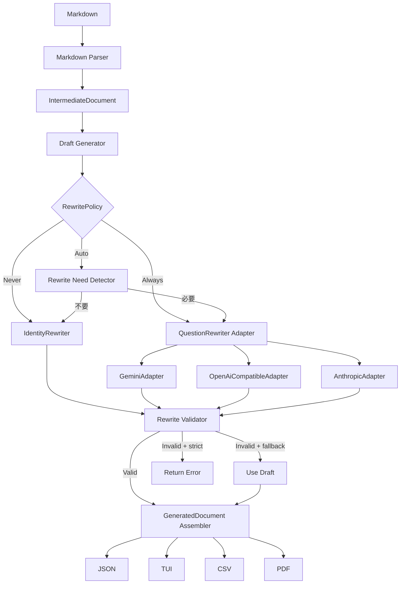

# FlowCloze LLMプロバイダ・アダプタ化 改修案

- 対象リポジトリ: `sankaku789/FlowCloze`
- 調査対象: `main` ブランチ
- 作成日: 2026-07-31
- 文書ステータス: 初期提案

## 1. 要約

FlowClozeを、次の構成へ段階的に変更する。

1. Markdown解析、解答箇所の確定、空欄化、最終JSONの組み立て、検証はFlowCloze Coreが担当する
2. LLMは、Coreが生成した穴埋め下書きを自然な文章へ整える処理だけを担当する
3. Core側に共通ポート `QuestionRewriter` を定義する
4. Gemini、OpenAI互換API、将来のAnthropicなどをアダプタとして実装する
5. LLMなしで動作する `IdentityRewriter` を用意する
6. 生成ブレのテストは、Coreの完全一致テストとLLM出力の不変条件テストに分離する
7. 初期段階ではHTTPサーバーを内蔵せず、Rust APIとCLI・JSON入出力を安定したAPI境界とする

最終的な責務分担は以下とする。

```text
Markdown note
    │
    ▼
FlowCloze Core
    ├─ qblock / target解析
    ├─ 空欄化
    ├─ 問題文の決定的な下書き生成
    ├─ 固定フィールドの組み立て
    └─ 出力検証
    │
    ▼
QuestionRewriter Port
    ├─ IdentityRewriter
    ├─ GeminiAdapter
    ├─ OpenAiCompatibleAdapter
    └─ AnthropicAdapter（将来）
    │
    ▼
FlowCloze Coreによる再検証
    │
    ▼
JSON / TUI / CSV / PDF
```

## 2. 背景

現行FlowClozeは、Markdown内の `#qblock{ ... }` と `[答え]` を解析し、中間JSONを作成したうえでGeminiへ問題文生成を依頼している。

既に次の情報はRust側で決定できている。

- qblock ID
- section
- target
- answers
- source text
- 空欄数
- 問題の並び順
- 出力形式
- warning

一方で、現在は以下がGemini固有の実装・名称へ直接結合している。

- `GeminiClient`
- `GeminiError`
- `build_generation_prompt`
- Gemini APIのリクエスト・レスポンス構造
- JSON Schema
- CLIのAPIキー・モデル設定
- `generate_with_gemini`

このままプロバイダを追加すると、CLI、設定、通信、プロンプト、エラー処理がプロバイダごとに増殖する。

また、LLMが最終出力に近い構造を返す構成では、文章以外の項目まで生成ブレや欠落の影響を受ける。

## 3. 改修目標

### 3.1 機能目標

- Gemini以外のLLMプロバイダを追加可能にする
- OpenAI互換API経由でOpenAI、Ollama、LM Studioなどを扱えるようにする
- LLMなしでも文章補完問題を生成可能にする
- Markdownから文章補完問題を生成する現在の利用体裁を維持する
- 既存のJSON、TUI、CSV、PDF出力を維持する
- API障害や不正なLLM出力時に安全にフォールバックできるようにする

### 3.2 品質目標

- 同じMarkdownから同じ中間データと下書きを生成する
- LLMの出力が変動しても、ID、解答、空欄数、順序、元文章をCore側で固定する
- 各アダプタを共通の契約テストへ通せるようにする
- 実LLMを使わず、通常CIで主要な生成パイプラインを検証できるようにする
- プロンプトやモデル変更による品質変化を追跡できるようにする

### 3.3 非目標

初期改修では次を行わない。

- FlowCloze本体へのHTTPサーバー内蔵
- 全LLMプロバイダの同時対応
- 高度な文章品質の自動採点
- LLMによる解答・target・sectionの推測
- 独自の大規模な日本語文章生成エンジン
- tool callingやエージェント機能
- プロバイダ固有機能の完全抽象化

## 4. 設計原則

### 4.1 Coreが主導権を持つ

LLMへ最終問題データを作らせない。

Coreが先に生成タスクを確定し、LLMへ渡すのは文章の下書きと、文章を壊さないための制約だけとする。

### 4.2 LLMの返却値を最小化する

内部呼び出しでは、LLMにIDやJSON全体を返させず、書き換えた文章だけを返させる。

```text
＿＿＿は、顧客の要求を整理し、要求仕様としてまとめる工程である。
```

これにより、次の生成エラーを構造的に排除する。

- ID欠落
- ID重複
- タスク順序の変化
- questions件数の不一致
- answersの改変
- source textの改変
- sectionの欠落
- JSONルート構造の崩壊

### 4.3 アダプタは通信形式の変換だけを担当する

アダプタの責務:

- 認証
- URLとヘッダーの構築
- 共通リクエストから各社API形式への変換
- APIレスポンスから本文の抽出
- HTTP・APIエラーから共通エラーへの変換
- プロバイダ固有のリトライ条件の提供

アダプタの責務ではないもの:

- 空欄数の検証
- 解答漏洩の検出
- IDの管理
- 最終JSONの組み立て
- フォールバック判断
- Markdown解析
- 問題順序の管理

### 4.4 検証はCoreへ集約する

全アダプタの出力を同じ検証器へ通す。

プロバイダごとに同じ検証を重複実装しない。

### 4.5 APIの抽象化対象は「LLM」ではなく「文章書き換え」

`LlmProvider` ではなく、FlowClozeの用途を表す `QuestionRewriter` をポート名にする。

これにより、LLMを使わない実装やルールベース実装も同じ契約で扱える。

## 5. 提案アーキテクチャ



## 6. Core API案

### 6.1 公開生成API

```rust
pub fn generate(
    markdown: &str,
    options: &GenerateOptions,
    rewriter: Option<&dyn QuestionRewriter>,
) -> Result<GeneratedDocument, FlowClozeError>;
```

処理順:

1. Markdownを解析する
2. `IntermediateDocument` を構築する
3. 各タスクから決定的な問題文下書きを作る
4. `RewritePolicy` に応じて書き換えを実行する
5. 書き換え結果を検証する
6. 不正時は設定に従ってフォールバックまたはエラーにする
7. Coreが最終 `GeneratedDocument` を組み立てる

### 6.2 分割API

外部ツールやテストから各工程を利用しやすくするため、以下も公開候補とする。

```rust
pub fn parse_note(
    source_name: &str,
    markdown: &str,
) -> Result<IntermediateDocument, FlowClozeError>;

pub fn build_rewrite_tasks(
    document: &IntermediateDocument,
) -> Vec<RewriteTask>;

pub fn apply_rewrites(
    document: &IntermediateDocument,
    rewrites: &[RewriteOutput],
    policy: &ValidationPolicy,
) -> Result<GeneratedDocument, FlowClozeError>;
```

### 6.3 生成オプション

```rust
#[derive(Debug, Clone)]
pub struct GenerateOptions {
    pub rewrite_policy: RewritePolicy,
    pub fallback_policy: FallbackPolicy,
    pub validation_policy: ValidationPolicy,
}

#[derive(Debug, Clone, Copy, PartialEq, Eq)]
pub enum RewritePolicy {
    Never,
    Always,
    Auto,
}

#[derive(Debug, Clone, Copy, PartialEq, Eq)]
pub enum FallbackPolicy {
    UseDraft,
    ReturnError,
}
```

初期実装では `Auto` を未実装または実験扱いにし、`Never` と `Always` から開始する。

推奨初期既定値:

```rust
GenerateOptions {
    rewrite_policy: RewritePolicy::Never,
    fallback_policy: FallbackPolicy::UseDraft,
    validation_policy: ValidationPolicy::default(),
}
```

既存利用者との互換性を優先する場合は、移行期間のみCLIの既定値をGeminiの `Always` に維持し、次のメジャーバージョンで `Never` または `Auto` へ変更する。

## 7. QuestionRewriterポート

### 7.1 ポート定義

```rust
pub trait QuestionRewriter: Send + Sync {
    fn rewrite(
        &self,
        request: &RewriteRequest,
    ) -> Result<RewriteOutput, RewriteError>;
}
```

### 7.2 共通リクエスト

```rust
#[derive(Debug, Clone, PartialEq, Eq)]
pub struct RewriteRequest {
    pub draft: String,
    pub source_text: String,
    pub answers: Vec<String>,
    pub blank_token: String,
    pub constraints: RewriteConstraints,
    pub prompt_version: String,
}
```

`answers` は文章の自然さを確認する補助情報として渡す。ただし、LLMへ「出力しない固定情報」であることを明示する。

### 7.3 制約

```rust
#[derive(Debug, Clone, PartialEq, Eq)]
pub struct RewriteConstraints {
    pub blank_count: usize,
    pub preserve_blank_order: bool,
    pub prohibit_answer_leakage: bool,
    pub prohibit_new_information: bool,
    pub style: WritingStyle,
}

#[derive(Debug, Clone, Copy, PartialEq, Eq)]
pub enum WritingStyle {
    PlainJapanese,
}
```

### 7.4 共通レスポンス

```rust
#[derive(Debug, Clone, PartialEq, Eq)]
pub struct RewriteOutput {
    pub text: String,
    pub metadata: RewriteMetadata,
}

#[derive(Debug, Clone, PartialEq, Eq)]
pub struct RewriteMetadata {
    pub adapter: String,
    pub provider: String,
    pub model: String,
}
```

`metadata` はデバッグや品質追跡には使用するが、LLMに生成させない。アダプタが設定値から付与する。

### 7.5 共通エラー

```rust
#[derive(Debug)]
pub enum RewriteError {
    Configuration(String),
    Authentication,
    RateLimited {
        retry_after: Option<Duration>,
    },
    Timeout,
    Transport(String),
    Api {
        status: u16,
        message: String,
    },
    InvalidResponse(String),
    EmptyResponse,
}
```

アダプタは各社固有エラーをこの型へ変換する。

## 8. アダプタ案

### 8.1 IdentityRewriter

LLMを使用せず、下書きをそのまま返す。

```rust
pub struct IdentityRewriter;

impl QuestionRewriter for IdentityRewriter {
    fn rewrite(
        &self,
        request: &RewriteRequest,
    ) -> Result<RewriteOutput, RewriteError> {
        Ok(RewriteOutput {
            text: request.draft.clone(),
            metadata: RewriteMetadata {
                adapter: "identity".into(),
                provider: "flowcloze".into(),
                model: "deterministic".into(),
            },
        })
    }
}
```

役割:

- APIキーなしで生成可能にする
- CoreのE2Eテストに使う
- API障害時のフォールバック先にする
- LLM書き換え前後の比較基準にする

### 8.2 GeminiAdapter

現行 `GeminiClient` の通信処理を移行する。

保持するもの:

- `x-goog-api-key`
- Geminiリクエスト形式
- Geminiレスポンス形式
- Gemini固有のエラー解析

共通層へ移す候補:

- HTTPクライアント生成
- タイムアウト
- 指数バックオフ
- `Retry-After`
- 共通レスポンス正規化
- 空レスポンス判定

### 8.3 OpenAiCompatibleAdapter

初期対応範囲:

- OpenAI互換のchat/completions形式またはresponses形式のうち、実装を単純化できる一方
- 任意の `base_url`
- `Authorization: Bearer`
- 任意のモデル名
- OpenAI、Ollama、LM Studioなど

設定例:

```toml
[providers.local]
type = "openai-compatible"
base_url = "http://localhost:11434/v1"
model = "qwen3:8b"
api_key_env = "FLOWCLOZE_LOCAL_API_KEY"
```

互換実装間の差異が大きい場合、アダプタ内部に小さな互換オプションを持たせる。

```rust
pub struct OpenAiCompatibleConfig {
    pub base_url: String,
    pub model: String,
    pub api_key: Option<String>,
    pub response_mode: ResponseMode,
}
```

### 8.4 AnthropicAdapter

初期MVPには含めない。

GeminiとOpenAI互換アダプタの契約が安定してから追加する。

## 9. プロンプト設計

### 9.1 共通Prompt Builder

プロンプト本文はアダプタごとに別実装せず、Core側に共通ビルダーを置く。

```rust
pub trait RewritePromptBuilder {
    fn build(&self, request: &RewriteRequest) -> Prompt;
}
```

```rust
pub struct Prompt {
    pub system: String,
    pub user: String,
}
```

各アダプタは `Prompt` を各社APIのmessages、contentsなどへ変換する。

### 9.2 LLMへ依頼すること

- 下書きを自然な常体の日本語へ整える
- 空欄トークンの数と順序を維持する
- targetでない説明・条件・比較・例を維持する
- 元ノートにない知識を追加しない
- 文章だけを返す

### 9.3 LLMへ依頼しないこと

- 問題IDの生成
- sectionの生成
- targetの生成
- answersの生成
- source textの生成
- tagsの生成
- warningsの生成
- JSON全体の生成
- 問題順序の決定

### 9.4 プロンプトのバージョン管理

プロンプト変更による生成品質の変化を追跡するため、明示的なバージョンを持たせる。

```rust
pub const REWRITE_PROMPT_VERSION: &str = "rewrite-v1";
```

生成メタ情報またはデバッグログに以下を記録できるようにする。

- prompt version
- adapter
- provider
- model
- rewrite policy
- validation result
- fallbackの有無

## 10. 最終JSONの組み立て

LLMのレスポンスを `GeneratedQuestion` へ直接Deserializeしない。

Coreが `IntermediateTask` と `RewriteOutput` から決定的に組み立てる。

```rust
fn assemble_question(
    task: &IntermediateTask,
    rewritten_text: String,
) -> GeneratedQuestion {
    GeneratedQuestion {
        id: task.id.clone(),
        section: task.section.clone(),
        question_type: task.task_type.clone(),
        targets: Some(
            task.targets
                .iter()
                .map(GeneratedTarget::from)
                .collect(),
        ),
        question: rewritten_text,
        answers: task.answers.clone(),
        source_text: Some(task.source.plain.clone()),
        explanation: None,
        tags: Vec::new(),
        warnings: task.warnings.clone(),
    }
}
```

これにより、LLMの生成ブレが影響するフィールドを `question` に限定する。

## 11. 検証とフォールバック

### 11.1 書き換え結果の検証項目

必須:

- 文章が空でない
- 空欄数が `answers.len()` と一致する
- 空欄トークンが変更されていない
- 解答文字列が問題文へ露出していない
- 異常に短くなっていない
- 異常に長くなっていない

推奨:

- 空欄へ解答を戻した文章が空にならない
- 元の下書きに存在した非target情報が大きく失われていない
- 新しいURLや固有形式が追加されていない
- Markdownコードフェンスなど不要なラッパーを除去できる

### 11.2 検証エラー案

```rust
pub enum RewriteValidationError {
    EmptyText,
    BlankCountMismatch {
        expected: usize,
        actual: usize,
    },
    AnswerLeakage {
        answer: String,
    },
    TooShort {
        original_chars: usize,
        rewritten_chars: usize,
    },
    TooLong {
        original_chars: usize,
        rewritten_chars: usize,
    },
}
```

### 11.3 フォールバック

```rust
let final_text = match rewriter.rewrite(&request) {
    Ok(output) => match validate_rewrite(&request, &output.text) {
        Ok(()) => output.text,
        Err(error) => match fallback_policy {
            FallbackPolicy::UseDraft => request.draft.clone(),
            FallbackPolicy::ReturnError => return Err(error.into()),
        },
    },
    Err(error) => match fallback_policy {
        FallbackPolicy::UseDraft => request.draft.clone(),
        FallbackPolicy::ReturnError => return Err(error.into()),
    },
};
```

### 11.4 再試行方針

通信エラーの再試行と、内容不正の再生成を分ける。

- HTTP 429、408、502、503、504、接続失敗、タイムアウト  
  → アダプタまたは共通HTTP層で再試行
- 空欄数不一致、答え漏洩、空文字  
  → 生成オーケストレータが修正指示付きで再生成
- 認証エラー、設定エラー、400系の恒久エラー  
  → 再試行しない

初期実装では複雑化を避け、内容不正時は1回だけ再生成し、それでも失敗したら下書きへフォールバックする案を推奨する。

## 12. CLI案

### 12.1 基本操作

```bash
# LLMなし
flowcloze generate note.md

# Geminiを使用
flowcloze generate note.md \
  --rewrite always \
  --provider gemini

# OpenAI互換APIを使用
flowcloze generate note.md \
  --rewrite always \
  --provider local

# LLMを使わず厳密に決定的生成
flowcloze generate note.md \
  --rewrite never

# 将来
flowcloze generate note.md \
  --rewrite auto
```

### 12.2 CLIオプション

```text
--rewrite <never|always|auto>
--provider <provider-name>
--model <model-name>
--base-url <url>
--fallback <draft|error>
```

設定の優先順位:

```text
CLI引数
  > 環境変数
  > config.toml
  > 組み込み既定値
```

### 12.3 設定ファイル

APIキー本体を設定ファイルへ保存せず、環境変数名を保存する。

```toml
default_provider = "gemini"

[providers.gemini]
type = "gemini"
model = "gemini-2.5-flash"
api_key_env = "GEMINI_API_KEY"

[providers.openai]
type = "openai-compatible"
base_url = "https://api.openai.com/v1"
model = "MODEL_NAME"
api_key_env = "OPENAI_API_KEY"

[providers.local]
type = "openai-compatible"
base_url = "http://localhost:11434/v1"
model = "qwen3:8b"
api_key_env = "FLOWCLOZE_LOCAL_API_KEY"
```

### 12.4 既存CLIの互換性

現行:

```bash
flowcloze generate --model gemini-2.5-flash note.md
flowcloze api set --key ...
```

移行案:

- `--model` は維持する
- provider未指定時は移行期間のみGemini設定を参照する
- `api set` は非推奨警告を出しつつ当面維持する
- 新規設定コマンドを追加する

```bash
flowcloze config provider add gemini \
  --type gemini \
  --model gemini-2.5-flash \
  --api-key-env GEMINI_API_KEY
```

設定CLIはMVP後でもよい。最初は環境変数とCLI指定だけでも成立する。

## 13. JSON・標準入出力API

HTTP APIより先に、プロセス境界として安定したJSON形式を定義する。

### 13.1 Rewrite Request出力

```bash
flowcloze rewrite-request note.md > request.json
```

```json
{
  "schema_version": 1,
  "tasks": [
    {
      "id": "qblock-001",
      "draft": "＿＿＿は顧客の要求を整理する工程である。",
      "source_text": "要求定義は顧客の要求を整理する工程である。",
      "answers": ["要求定義"],
      "blank_token": "＿＿＿",
      "constraints": {
        "blank_count": 1,
        "preserve_blank_order": true,
        "prohibit_answer_leakage": true,
        "prohibit_new_information": true
      }
    }
  ]
}
```

### 13.2 Rewrite Response適用

```bash
flowcloze apply-rewrites request.json rewrites.json
```

```json
{
  "schema_version": 1,
  "rewrites": [
    {
      "id": "qblock-001",
      "text": "＿＿＿とは、顧客の要求を整理する工程である。"
    }
  ]
}
```

外部プロセスとの対応付けではIDを使用する。ただし、内部アダプタ呼び出しではLLMにIDを生成させない。

### 13.3 HTTP APIの扱い

HTTPサーバーが必要になった場合は別crateとする。

```text
flowcloze-core
flowcloze-cli
flowcloze-server
```

`flowcloze-core` へWebフレームワーク依存を入れない。

## 14. 推奨ファイル構成

初期改修では大規模移動を避け、以下から開始する。

```text
src/
├── rewrite/
│   ├── mod.rs
│   ├── types.rs
│   ├── prompt.rs
│   ├── validation.rs
│   ├── identity.rs
│   └── adapter/
│       ├── mod.rs
│       ├── gemini.rs
│       └── openai_compatible.rs
├── http/
│   ├── mod.rs
│   └── retry.rs
├── config.rs
├── generation.rs
├── json.rs
├── parser.rs
├── validation.rs
├── lib.rs
└── main.rs
```

既存ファイルとの対応:

| 現行 | 改修後 |
|---|---|
| `src/gemini.rs` | `src/rewrite/adapter/gemini.rs` |
| `src/prompt.rs` | `src/rewrite/prompt.rs` |
| `generate_with_gemini` | `generate_questions` |
| `GeminiClient` | `GeminiAdapter` |
| `GeminiError` | `RewriteError`への変換 |
| 完全な生成JSON Schema | 原則廃止または文字列抽出用の最小構造へ縮小 |

## 15. TDD方針

### 15.1 テストの基本思想

目標は「実LLMの出力を毎回完全一致させる」ことではない。

目標は以下とする。

> LLMがどのような文章を返しても、FlowClozeのデータ構造、解答、空欄、順序、検証結果が意図せず変動しないこと。

### 15.2 テスト層

#### A. Core単体テスト

完全一致で検証する。

対象:

- Markdown解析
- qblock ID採番
- target抽出
- target type
- block分割
- cloze draft生成
- answers順序
- `GeneratedDocument` 組み立て
- フォールバック
- 設定解決

```rust
#[test]
fn same_markdown_produces_same_intermediate_document() {
    let first = parse_note("note.md", FIXTURE).unwrap();
    let second = parse_note("note.md", FIXTURE).unwrap();

    assert_eq!(first, second);
}
```

#### B. ゴールデンテスト

代表的なMarkdownから期待するJSONを完全一致で比較する。

```text
tests/fixtures/
├── notes/
│   ├── simple.md
│   ├── multi_target.md
│   ├── headings.md
│   ├── paragraphs.md
│   └── unknown_type.md
├── intermediate/
│   ├── simple.json
│   └── ...
└── generated/
    ├── simple.identity.json
    └── ...
```

意図的な仕様変更時のみゴールデンファイルを更新する。

#### C. QuestionRewriter契約テスト

すべてのアダプタへ共通の契約を適用する。

最低限の契約:

- 正常レスポンスから文章を抽出できる
- 空レスポンスをエラーにする
- 認証エラーを共通エラーへ変換する
- レート制限を共通エラーへ変換する
- タイムアウトを共通エラーへ変換する
- プロバイダ名・モデル名をmetadataへ設定する
- Core内部型をプロバイダ固有型へ漏らさない

#### D. HTTPモックテスト

実APIを呼ばず、固定HTTPレスポンスでアダプタを検証する。

推奨候補:

- `wiremock`
- `httpmock`

検証内容:

- URL
- HTTP method
- ヘッダー
- request body
- response body解析
- 429・503再試行
- `Retry-After`
- malformed JSON
- 本文欠落
- コードフェンス除去が必要な場合の正規化

#### E. Rewrite不変条件テスト

文章の完全一致ではなく制約を検証する。

```rust
#[test]
fn rewritten_question_preserves_blank_count() {
    let request = fixture_request();
    let text = "＿＿＿は、要求を整理する工程である。";

    assert!(validate_rewrite(&request, text).is_ok());
}
```

テスト対象:

- 空欄数維持
- 解答漏洩禁止
- 空文字禁止
- 異常な長文化禁止
- 異常な短縮禁止
- 不正時のフォールバック
- strictモードではエラー

#### F. プロパティテスト

`proptest` の導入を検討する。

対象例:

- target数と空欄数が常に一致する
- 任意の複数targetでもanswers順序を維持する
- `assemble_question` は入力タスクの固定フィールドを変更しない
- 同じ `IntermediateDocument` と `RewriteOutput` から同じ結果を生成する

#### G. 実LLMスモークテスト

通常CIの必須チェックから分離する。

```bash
cargo test
cargo test --features live-gemini -- --ignored
cargo test --features live-openai-compatible -- --ignored
```

用途:

- API仕様変更の早期検知
- 実モデルでの空欄維持率の計測
- プロンプト変更前後の品質比較
- 定期実行による劣化検知

実LLMテストは文章の完全一致を要求しない。

記録する指標例:

- 成功率
- 空欄数一致率
- 解答漏洩率
- フォールバック率
- 平均応答時間
- 平均入力・出力文字数
- provider / model / prompt version

### 15.3 TDDの実装順

各変更は次の順序で進める。

1. 失敗するテストを書く
2. 最小実装を追加する
3. テストを通す
4. 重複を整理する
5. ゴールデン差分を確認する
6. 既存CLIの回帰テストを通す

## 16. 初期テストケース

最初に以下を固定する。

### Core

1. 同じMarkdownから同じ `IntermediateDocument` を生成する
2. target順とanswers順が一致する
3. LLM出力に関係なくID、section、targets、answers、source textが維持される
4. `IdentityRewriter` は下書きをそのまま返す
5. LLMなしで最終JSONを生成できる

### Validation

6. 空欄数が変わった出力を拒否する
7. 解答文字列が露出した出力を拒否する
8. 空文字を拒否する
9. 不正時に下書きへフォールバックする
10. strictモードでは不正出力をエラーにする

### Adapters

11. Geminiレスポンスから文章を抽出する
12. OpenAI互換レスポンスから文章を抽出する
13. 429を再試行する
14. 401を再試行しない
15. 503を再試行する
16. タイムアウトを共通エラーへ変換する
17. 空レスポンスを拒否する

### End-to-End

18. Markdown → Identity → Generated JSONが完全一致する
19. Markdown → StubRewriter → Generated JSONが完全一致する
20. StubRewriterが不正出力を返した場合に下書きへフォールバックする

## 17. 段階的な改修計画

### Phase 0: 現行挙動の固定

目的:

- 改修前の意図しない変更を検出可能にする

作業:

- 代表的fixtureを追加
- Markdown → Intermediate JSONのゴールデンテスト
- 現行Geminiレスポンス → Generated JSONのモックテスト
- 現行CLI引数解析のテスト補強
- 既存の検証仕様をテストで固定

完了条件:

- 実APIなしで主要経路をテストできる
- 現行の代表的出力がゴールデン化されている

### Phase 1: Coreによる最終JSON組み立て

目的:

- LLMが最終JSON全体を生成する構成をやめる

作業:

- `assemble_question`
- `assemble_document`
- `RewriteOutput`
- LLMレスポンスを文章だけとして扱う
- 固定フィールドを `IntermediateTask` から設定

完了条件:

- LLMの返却値が文章だけでも現在のGenerated JSONを作れる
- ID、answers、targetsなどがLLM出力に依存しない

### Phase 2: QuestionRewriterポート導入

目的:

- Coreとプロバイダ固有通信を分離する

作業:

- `QuestionRewriter`
- `RewriteRequest`
- `RewriteOutput`
- `RewriteError`
- Stub実装
- 共通契約テスト

完了条件:

- 生成パイプラインが `GeminiClient` を直接参照しない
- StubRewriterでE2Eテストが通る

### Phase 3: GeminiAdapter移行

目的:

- 既存Gemini機能をアダプタへ移す

作業:

- `GeminiClient` を `GeminiAdapter` へ置換
- リクエスト形式変換
- レスポンス本文抽出
- 共通エラー変換
- HTTPモックテスト
- 現行リトライ挙動の維持

完了条件:

- 既存Gemini生成が新しいポート経由で動く
- Gemini固有型がCoreへ露出しない

### Phase 4: IdentityRewriter導入

目的:

- LLMなし生成を実現する

作業:

- `IdentityRewriter`
- `--rewrite never`
- APIキーなしの生成
- 不正LLM出力時のフォールバック
- Identity経路のゴールデンテスト

完了条件:

- APIキーなしでMarkdownからGenerated JSONを作れる
- JSON、TUI、CSV、PDFの既存後段へ接続できる

### Phase 5: OpenAiCompatibleAdapter追加

目的:

- 複数プロバイダとローカルLLMへ対応する

作業:

- 任意base URL
- Bearer認証
- model指定
- レスポンス本文抽出
- Ollama・LM Studioを想定した設定
- HTTPモック契約テスト

完了条件:

- GeminiとOpenAI互換アダプタが同じCore契約で動く
- CLIからproviderを選択できる

### Phase 6: 設定管理

目的:

- 複数プロバイダ設定を安全に扱う

作業:

- `config.toml`
- 環境変数参照
- CLI上書き
- 既存 `.env` 設定との互換
- 秘密情報を設定ファイルへ直接保存しない

完了条件:

- provider名で設定を選択できる
- 設定優先順位がテストされている

### Phase 7: RewritePolicy::Auto

目的:

- 必要な問題だけLLMへ送る

初期判定候補:

- 複数block
- 箇条書きが複数存在
- 文末が不完全
- 下書きが極端に短い
- 接続されていない断片が多い
- 明示的な `--rewrite always`

完了条件:

- 判定ロジックが決定的
- 判定理由をデバッグ表示できる
- `Never` と `Always` の挙動を壊さない

### Phase 8: AnthropicAdapter・HTTP API

利用要件が明確になってから着手する。

## 18. PR分割案

### PR 1: Characterization tests

- fixture追加
- 現行挙動のゴールデンテスト
- CLI回帰テスト
- コード変更は最小限

### PR 2: Deterministic assembler

- CoreによるGenerated JSON組み立て
- LLM返却を文章へ縮小
- validation拡張

### PR 3: QuestionRewriter port

- 共通型
- trait
- StubRewriter
- 契約テスト

### PR 4: Gemini adapter

- 現行Gemini実装移行
- HTTP共通処理
- モックテスト

### PR 5: Identity and fallback

- LLMなし生成
- rewrite policy
- fallback policy
- CLI追加

### PR 6: OpenAI-compatible adapter

- adapter実装
- provider選択
- 設定
- モックテスト

### PR 7: Auto rewrite

- 必要性判定
- メトリクス
- ドキュメント更新

## 19. 互換性とバージョニング

### 19.1 中間JSON

現行の `IntermediateDocument` は、既に必要な情報を多く持っている。

可能な限り既存schema versionを維持し、破壊的変更が必要な場合のみversionを上げる。

変更候補:

- `cloze_template` が「元の文章」と「穴埋め下書き」を連結した文字列になっているため、将来的に構造化する

```json
{
  "draft": "＿＿＿は顧客の要求を整理する工程である。",
  "source_text": "要求定義は顧客の要求を整理する工程である。"
}
```

ただし初期改修では、既存の `source.plain` と `blocks[].cloze_text` から `RewriteRequest` を構築し、schema変更を避ける。

### 19.2 生成JSON

既存の出力形式は維持する。

内部の生成方法だけを変更し、CSV、PDF、TUIへの影響を最小化する。

### 19.3 CLI

移行期間:

- 現行コマンドを維持
- 新オプションを追加
- 廃止予定のコマンドには警告
- READMEに旧・新両方の例を記載

## 20. リスクと対策

| リスク | 対策 |
|---|---|
| 抽象化が過剰になる | 最初はGemini、Identity、OpenAI互換の3実装に限定 |
| 共通APIが各社固有機能を妨げる | Core契約を文章書き換えに限定し、固有設定は各AdapterConfigへ置く |
| LLMなしの文章品質が低い | 「必ず生成できる」フォールバックとして位置付け、自然さは保証しない |
| 単件リクエストで遅くなる | traitは単件でも、将来 `rewrite_batch` を追加可能にする |
| OpenAI互換APIの差異 | base URLとresponse modeを設定可能にし、モックfixtureを複数持つ |
| プロンプト変更で品質が下がる | prompt version、固定評価fixture、定期live test |
| 実LLMテストが不安定 | CI必須から分離し、制約成功率を観測する |
| フォールバックで品質低下が隠れる | warning、metadata、終了時サマリーでfallback件数を表示 |
| 設定ファイルへ秘密情報が残る | APIキー本体ではなく環境変数名を保存 |
| 既存JSON利用者への影響 | 出力schemaを維持し、内部実装のみ変更 |

## 21. MVPスコープ

最初のリリースで実装するもの:

- `QuestionRewriter`
- `RewriteRequest`
- `RewriteOutput`
- `RewriteError`
- Coreによる最終JSON組み立て
- `GeminiAdapter`
- `IdentityRewriter`
- `OpenAiCompatibleAdapter`
- `RewritePolicy::Never`
- `RewritePolicy::Always`
- `FallbackPolicy::UseDraft`
- `FallbackPolicy::ReturnError`
- Core完全一致テスト
- Adapterモック契約テスト
- Rewrite不変条件テスト
- 既存CLIとの基本互換

後回し:

- `RewritePolicy::Auto`
- AnthropicAdapter
- HTTP server
- 非同期バッチ
- キャッシュ
- 品質スコアリング
- 高度な設定CLI

## 22. Definition of Done

MVPは次を満たした時点で完了とする。

- [ ] `cargo test` が実APIなしで通る
- [ ] 同じMarkdownから同じ中間JSONを生成する
- [ ] LLMなしでGenerated JSONを生成できる
- [ ] Geminiが `QuestionRewriter` 経由で動作する
- [ ] OpenAI互換APIが `QuestionRewriter` 経由で動作する
- [ ] LLMが変更できるのは最終問題文だけである
- [ ] ID、section、targets、answers、source text、順序はCoreが決定する
- [ ] 空欄数不一致を検出できる
- [ ] 解答漏洩を検出できる
- [ ] 不正出力時に下書きへフォールバックできる
- [ ] strictモードでは不正出力をエラーにできる
- [ ] 429・503・タイムアウトのモックテストがある
- [ ] 認証エラーを不要に再試行しない
- [ ] 既存JSON、TUI、CSV、PDF出力が回帰テストを通る
- [ ] READMEにprovider選択とLLMなし生成を記載する

## 23. 推奨する最初の着手

最初の実装は、プロバイダ追加ではなく以下から始める。

1. 現行出力のゴールデンテストを作る
2. Coreで最終JSONを組み立てる関数を作る
3. `QuestionRewriter` とStubを導入する
4. Stubで生成パイプラインを通す
5. Geminiをアダプタへ移す
6. Identityを追加する
7. OpenAI互換アダプタを追加する

特に、先に `QuestionRewriter` だけ作っても、LLMが最終JSON全体を作るままでは責務分離が不完全になる。

そのため、最優先事項は以下である。

> LLMの返却値を問題文だけに縮小し、最終JSONをFlowCloze Coreが決定的に組み立てる。

これを完了してから、各プロバイダをアダプタとして追加する。
